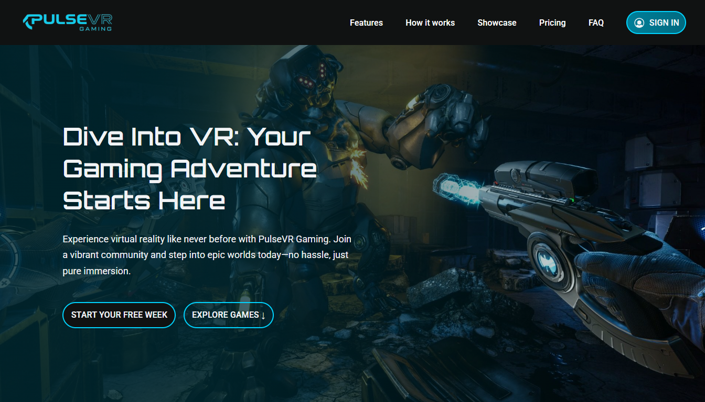

# PulseVR


[](http://pulse-vr.vercel.app/)
[](LICENSE)



## 🌐 Demo

Here is a working live demo: http://pulse-vr.vercel.app/

## 📝 Description

Welcome to PulseVR! This project is a responsive landing page for a fictional virtual reality gaming startup. It was built from the ground up to showcase a modern, single-page application that is both visually engaging and highly performant. The primary goal was to create an immersive user experience that effectively communicates the fictional brand's offerings, from game showcases to flexible rental and subscription plans, all within a clean and maintainable codebase.

## 📖 Table of Contents

- [🌐 Demo](#-demo)
- [📝 Description](#-description)
- [✨ Features](#-features)
- [🛠️ Setup Project](#️-setup-project)
  - [🍴 Prerequisites](#-prerequisites)
  - [🚀 Install Project](#-install-project)
- [🤝 Contributing and Support](#-contributing-and-support)
  - [⚒️ How to Contribute](#️-how-to-contribute)
  - [📩 Bug Report](#-bug-report)
- [📞 Contact Me](#-contact-me)
- [📋 License](#-license)

## ✨ Features

👉 **Sticky Navigation**: A responsive header that becomes fixed on scroll for seamless navigation throughout the page.

👉 **Dynamic Hero Section**: An immersive above-the-fold area to capture user attention instantly.

👉 **Feature Showcase**: A detailed breakdown of services using a clean, card-based layout.

👉 **Flexible Rental Options**: A visually organized section displaying VR hardware available for rent.

👉 **Step-by-Step Guide**: A simple, numbered guide explaining how to get started with the service.

👉 **Game Spotlight**: A showcase of featured games, complete with auto-playing video panels for a dynamic preview.

👉 **Tiered Pricing Table**: A clear, side-by-side comparison of different subscription plans.

👉 **Interactive FAQ**: A user-friendly, collapsible accordion to provide answers to frequently asked questions.

👉 **Fully Responsive Design**: Enjoy a seamless experience across all devices, from mobile phones to desktops.

## 💻 Technologies Used

- [![React][React.js]][React-url]
- [![TypeScript][TypeScript]][TypeScript-url]
- [![Vite][Vite]][Vite-url]
- [![TailwindCSS][TailwindCSS]][TailwindCSS-url]
- [![ESLint][ESLint]][ESLint-url]
- [![Prettier][Prettier]][Prettier-url]

## 🛠️ Setup Project

To get this project up and running in your development environment, follow these step-by-step instructions.

### 🍴 Prerequisites

We need to install or make sure that these tools are pre-installed on your machine:

- [NodeJS](https://nodejs.org/en): It is a JavaScript runtime build.
- [Git](https://git-scm.com/downloads): It is an open source version control system.

### 🚀 Install Project

1. Clone the Repository

```bash
git clone https://github.com/janrizmlibres/pulse-vr.git
```

2. Install packages in the project directory

```
npm install
```

3. Run the development server

```bash
npm run dev
```

The application will be available at `http://localhost:5173`. This project does not require any `.env` variables to run.

## 🤝 Contributing and Support

### ⚒️ How to Contribute

Want to contribute? Great!

To fix a bug or enhance an existing feature, follow these steps:

- Fork the repo
- Create a new branch (`git checkout -b improve-feature`)
- Make the appropriate changes in the files
- Add changes to reflect the changes made
- Commit your changes (`git commit -am 'Improve feature'`)
- Push to the branch (`git push origin improve-feature`)
- Create a Pull Request

### 📩 Bug Report

If you find a bug, kindly open an issue [here](https://github.com/janrizmlibres/pulse-vr/issues/new) by including a description of your problem and the expected result.

## 📞 Contact Me

[
](https://www.linkedin.com/in/janrizlibres/)

## 📋 License

[MIT](https://choosealicense.com/licenses/mit/)
Released 2025 by Janriz Libres @janrizmlibres

[React.js]: https://img.shields.io/badge/react-%2320232a.svg?style=for-the-badge&logo=react&logoColor=%2361DAFB
[React-url]: https://react.dev/
[TypeScript]: https://img.shields.io/badge/typescript-%23007ACC.svg?style=for-the-badge&logo=typescript&logoColor=white
[TypeScript-url]: https://www.typescriptlang.org/
[Vite]: https://img.shields.io/badge/vite-%23646CFF.svg?style=for-the-badge&logo=vite&logoColor=white
[Vite-url]: https://vite.dev/
[TailwindCSS]: https://img.shields.io/badge/tailwindcss-%2338B2AC.svg?style=for-the-badge&logo=tailwind-css&logoColor=white
[TailwindCSS-url]: https://tailwindcss.com/
[ESLint]: https://img.shields.io/badge/ESLint-4B3263?style=for-the-badge&logo=eslint&logoColor=white
[ESLint-url]: https://eslint.org/
[Prettier]: https://img.shields.io/badge/prettier-%23F7B93E.svg?style=for-the-badge&logo=prettier&logoColor=black
[Prettier-url]: https://prettier.io/
